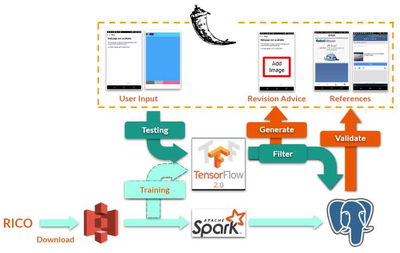

# ui-design-grader
AppDecoder V1.0. Insight Data Engineering Project NY 20A

### Getting Started
These instructions will provide you a brief description of my project, and a guideline for our codes as well on how to run those modules on corresponding AWS EC2 instances for development and testing purposes.

### Description 
The objective is to build a data-driven APP design recommendation platform (see the [website](http://www.dataengineer.site/) or the [video demo](https://youtu.be/SUgCPqrCQWE)). The user are required to input the current layout design image accompanied with the labeled semenatic annotation image, and the output would be the recommendation on how to revise your current layout, as well as the refering UI designs in my current database.

### Dataset
The dataset is a large and publicly accessible APP design dataset called RICO (site: http://interactionmining.org/rico). You can download full dataset from that website. The dataset contains several elements: 1. UI Screenshots and View Hierarchies; 2. UI Metadata; 3. UI Layout Vectors; 4. Interaction Traces; 5. Animations; 6. Play Store Metadata; 7. UI Screenshots and Hierarchies with Semantic Annotations. 

(Note: currently, 1, 2, 6, 7 are used in AppDecoder v1.0. The rest would be used in future developments.)

### Pipeline

***Offline Job***: Currently, metadata and view hirearchy files are ingested from S3 bucket into Spark. Spark processes the metadata and saves the static tables into the PostgreSQL database. Also, all UIs' hirearchy files are parsed in Spark into rows of elements information. Those are stacked into one table in PostgresSQL database. Meanwhile, semantic annotation images are participated in model training by Tensorflow 2.0.

***Online Job***: The flask front-end is loaded on the pre-trained model. The user inputs would directly led to the model, and give the generated results and similar candidates. A filter is processed on the candidates to check if the revised elements are contained in the candidates' layout. The qualified candidates are displayed on the platform.

### Introducing the files in project

    |-- flask
        |-- app
            |-- fonts
            |-- static
            |-- templates
            |-- tf2
                |-- tf2vae
                |-- generate.py
                |-- models.py
            |-- __init__.py
            |-- interface.py
            |-- query.py
        |-- testimage
        |-- config.ini
        |-- install.sh
        |-- wsgi.py
        |-- requirements.txt
    |-- spark
        |-- func
            |-- metadata.py
            |-- model.py
            |-- ui_semantic.py
            |-- utils.py
        |-- localdata
        |-- config.ini
        |-- install.sh
        |-- run.py
        |-- save_to_db.py
        |-- requirements.txt
    |-- documents
    |-- LICENSE
    |-- README.md

        
            
*flask frontend*

* flask/app: The folder contains all basic elements such as fonts, static (.css, .js) files, and website templates (.html) and the functions for the server.
    * interface.py
    >contains view functions that mapped to request URLs.
    * query.py
    >contains the connection and query function to PostgreSQL database.  

* flask/app/tf2: The tensorflow 2.0 implementation of the deep learning models. Currently, I include Convolutional AutoEncoder ([article](http://users.cecs.anu.edu.au/~Tom.Gedeon/conf/ABCs2018/paper/ABCs2018_paper_58.pdf)), and Variational AutoEncoder ([article](https://arxiv.org/abs/1312.6114)) models.
    * models.py
    >contains class 'Model' to run tests on current models with customized choice. Mainly AE, VAE, VAE-GAN (not updated yet) models can be chosen.
    * generate.py
    >contains the computer-vision methods that refine the output of generative models. 

* flask/testimage
>contains the test images for users. You can upload those to the website.

* flask/install.sh
>contains the steps of enviromental settings.

* wsgi.py
>the script to import the app package and start the server.

*spark backend*

* spark/func
>contains all functions and classes to load in different format of data.

* install.sh
>contains the steps of enviromental settings.

* run.py
>contains the first implementation of similarity calculation.

* save_to_db.py
>contains the static table storage to PostgreSQL.

### Prerequisites
The coding is based on PyTorch 0.4.0 with CUDA 9.1 and CUDNN 7.5. The project is implemented originally on Google Cloud Platform (GCP).
Basically, you need these tools:

`pip install numpy matplotlib scipy nibabel pandas skimage`

See full details of the environment requirements in *requirements.txt*.

### How to run the code 

* Make connection to the dataset.
>Multiple options to prepare the dataset:
1. Use the example dataset we prepared. (It's already in folder *mnt*, but the small one that can only used for testing and cannot used for training.)

2. Download from HCP dataset (The link above). But you need to downgrade the HR images by yourself. Here we provide an offline version MATLAB code for you (see kspace.m). Local storage is required. Online version is not provided in consideration of privacy. Then, arrange the data similarly in folder *mnt*.

3. Request for full access to our Google Storage: gs://hz2538. After being accepted, use `gcsfuse --implicit-dirs "hz2538" mnt` to mount the disk to your GCP VM instance or local machine. For `gcsfuse`, see details on their website: https://github.com/GoogleCloudPlatform/gcsfuse. Please contact Huixiang Zhuang: hz2538@columbia.edu.

* Open *main.ipynb* and execute all cells.

### Acknowledgements

We would present our sincere thanks to our research partners Jiayu Wang, Xiaomin He, Jieying Mai, who provide huge support on our project and have implemented Tensorflow version of this project (Their project link TO BE UPDATE).

